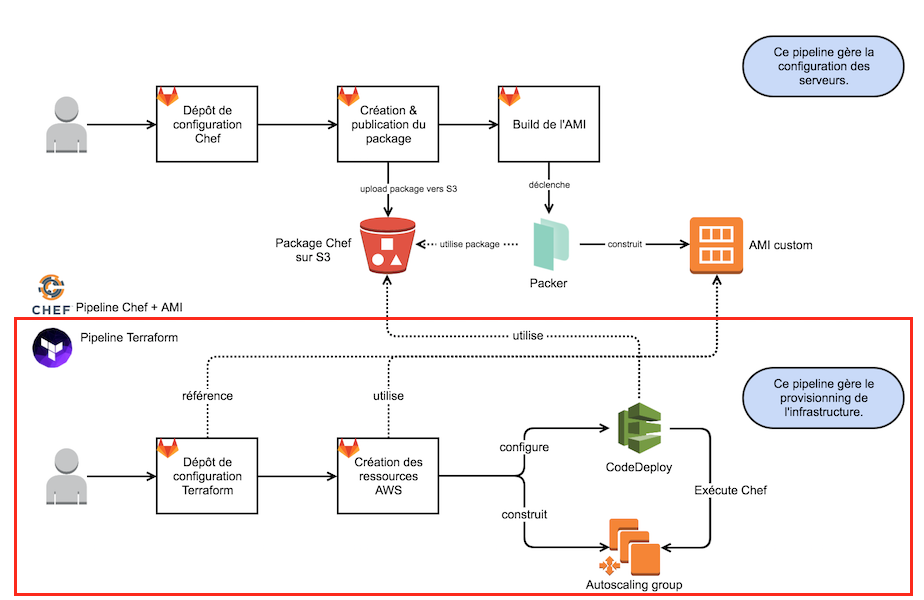

# Formation Terraform

Cette formation va aborder 4 thèmes principaux. Elle n'a encore jamais été dispensée, vos feedbacks seront donc bienvenue.

## Pré-requis

  * Disposer de notions sur Terraform, notament les notions de base (state file, plan, apply).
  * Disposer de notions sur AWS.

### I/ Développer et debugger du Terraform

La création d'une infrastructure simple avec Terraform est assez explicite. Cependant, la création de modules réutilisables est moins trivial. Comme le niveau de complexité de l'Infra-as-Code augmente rapidement, tout changement sur l'infra (apply), devient alors critique pour un environnement en production.

Ceci est d'autant plus vrai avec les projets multi-environnement.

#### **Notions de base**:

[Load Order and Semantics](https://www.terraform.io/docs/configuration/load.html):

le binaire terraform charge les fichiers .tf ou .tf.json.
les fichiers sont chargés dans l'ordre alphabétique à l'exception des fichiers [override](https://www.terraform.io/docs/configuration/override.html).

Les fichiers sont contacténés ensemble.

L'ordre n'importe pas.

S'il existe un lien de dépendance entre des ressources (l'une doit être créée avant l'autre), terraform le détecte grâce à son [graphe des ressources](https://www.terraform.io/docs/internals/graph.html).

Néanmoins, il existe le paramètre [depends_on](https://www.terraform.io/intro/getting-started/dependencies.html#implicit-and-explicit-dependencies) qui permet de définir implicitement des dépendances.

Enfin, la création de provider est une utilisation avancée qui ne sera pas abordée dans ce cours.

#### Rapide tour sur les commandes de bases (init, plan, apply):

Si vous ne les connaissez pas encore, lisez la documentation de ces trois commandes essentielles.

https://www.terraform.io/docs/commands/init.html

https://www.terraform.io/docs/commands/plan.html

https://www.terraform.io/docs/commands/apply.html

#### Commandes avancées:

https://www.terraform.io/docs/commands/refresh.html


https://www.terraform.io/docs/commands/state/index.html

https://www.terraform.io/docs/commands/import.html

#### Commandes output:

https://www.terraform.io/docs/commands/graph.html

https://www.terraform.io/docs/commands/output.html

#### Debugger:

https://www.terraform.io/docs/internals/debugging.html

### Provider [AWS](https://www.terraform.io/docs/providers/aws/index.html):

 Le provider AWS permet d'intéragir avec l'API AWS afin créer de l'infrastructure as code.

 Les providers proposent deux catégories d'objet:

** Les Data Sources:**

Elles permettent de récupérer des objets existants.

Exemple de data source aws_vpc:
```
variable "vpc_id" {}

data "aws_vpc" "selected" {
  id = "${var.vpc_id}"
}
```

les datasources sont appelées ainsi: `"${data.aws_vpc.selected.id}"`

** Les Resources:**

Elles permettent de créer des objets dans AWS.

```
resource "aws_vpc" "main" {
  cidr_block       = "10.0.0.0/16"
  instance_tenancy = "dedicated"

  tags {
    Name = "main"
  }
}
```

Enfin, notez que dans la documention `Argument Reference` contient les information d'entrées et `Attributes Reference` les sorties.

#### Exercices:

Le projet 1 est un bref aperçu sur les modules, le provider AWS et les interpolations.
Quelques erreurs ont été glissées pour faire du debug Terraform:

[Projet 1](./projet_1/README.md)

Le projet 2 nous permettra de mettre en place une instance EC2 depuis laquelle nous utiliserons Terraform (meta API):

[Projet 2](./projet_2/README.md)

Le projet 3 crash (intentionnellement):

[Projet 3](./projet_3/README.md)

### II/ Gérer différents environnements (dev, staging, prod) avec Terraform

Lors de la mise en place d'un projet multi-environnement, plusieurs contraintes sont mises en exergues:

**Contraintes de terraform:**

- Pas de traitement récursif des fichiers *.tf au "sens propre".
- Pas d'interpolation à l'intérieur des variables.
- Langage déclaratif (!= impératif)

Heureusement, les interpolations aident à rendre HCL un peu plus dynamique.

**Contraintes de l'environnement:**

- Compte AWS unique

OU
- Compte AWS Multiple

- VPC unique (séparation entre les différents environnements au niveau réseau, par découpage du réseau attaché au VPC en sous-réseaux)

OU

- Un VPC par environnement (bonnes pratiques AWS)

Une première approche consiste à utiliser une convention de nommage par environnement. (suffixer les fichier .tf avec le nom de l'env)
- Le problème réside dans la duplication du code en multiples endroits (don't repeat yourself [d.r.y])
- Une partie des variables sont identiques et pas d'autres.
- Augmentation rapide du nombre de fichier (perte de lisibilité)
- Les changements impactent toute l'infra (change preprod => impact prod)

**L'objectif à atteindre:**

- Séparer les environnements différents dans des répertoires
- Accéder aux ID de ressources créées pour un environnement à partir d'un autre
- Utiliser les modules terraform
- Utiliser un pipeline de CI (GitlabCI)
- Partager des variables (leur AWS ID surtout) communes entre les différents environnements
- Utiliser les remote terraform state

```bash
.
./initialize.tf
./variables.tf
./base
    |
    initialize.tf -> ../initialize.tf
    variables.tf -> ../variables.tf
    terraform.tfvars
    vpc.tf
    vpc_vars.tf
    security.tf
    internet_gateway.tf
    keypair.tf
    security_groups.tf
    rds_parameters.tf
    outputs.tf

./production
    |
    initialize.tf -> ../initialize.tf
    variables.tf -> ../variables.tf
    terraform.tfvars
    peering.tf
    subnets.tf
    security_groups.tf
    rds.tf
    redis.tf
    deploy.tf
    backend.tf
    cache.tf
    outputs.tf

./staging
    |
    initialize.tf -> ../initialize.tf
    variables.tf -> ../variables.tf
    terraform.tfvars
    peering.tf
    subnets.tf
    rds.tf
    redis.tf
    backend.tf
    cache.tf
```

- `variables.tf` : définitions des variables communes à l'ensemble des environnements.
- `initialize.tf` : liste des variables qui seront initialisées par les variables collectées dans le fichier terraform.tfvars.

le fichier `terraform.tfvars` est spécial:

    If a file named terraform.tfvars is present in the current directory, Terraform automatically loads it to populate variables. If the file is named something else, you can pass the path to the file using the -var-file flag.


Ainsi, les variables définies en output pour un environment (ex: base)

```HCL
output "vpc_id" {
  value = "${module.oxa-network.vpc_id}"
}


output "igw_id" {
  value = "${module.internet-gateway.igw_id}"
}


output "vpn_gateway_id" {
  value = "${module.oxa-network.vpn_gateway_id}"
}

output "vpc_peering_connection_id_svc" {
  value = "${module.oxa-network.vpc_peering_connection_id_svc}"
}
```

seront accessibles depuis un autre environnement (ex: production):

```HCL
# Subnets Production
module "subnets-production" {
  source = "git::ssh://git@oxalide.factory.git-01.adm/terraform/oxa-subnets.git"

  name        = "${var.customer}-${var.env}"
  environment = "${var.env}"

  vpc_id = "${data.terraform_remote_state.base_state.vpc_id}"
  igw_id = "${data.terraform_remote_state.base_state.igw_id}"

  public_subnets                = ["${var.cidrs_public}"]
  private_subnets               = ["${var.cidrs_private}"]
  azs                           = ["${var.zones}"]
}
```

#### Pros

- La datasource terraform_remote_state permet de passer les ID des ressources créées d'un environnement à un autre.
- Isolation des environnements.
- les variables gardent le même nom d'un environnement à un autre (seule leur valeur change)


#### Cons

- Le deplacement de ressources d'un environment à un autre est fastidieux et complexe, notamment lorsque des dépendances existent.
- Ne pas ommettre la declaration des variables dans `outputs.tf`
- L'execution répétée de terraform (une fois par envionnement)
- Execution ordonnées des environnements (Base en premier)

### Conlusion:

Ceci est une approche de création d'une Infra-as-Code multi-envrionnements.

D'autres approchent peuvent exister, notamment par l'utilisation extensive de `count` et des interpolations (map, operateur ternaire ...)

Merci à Hugues Lepesant pour son analyse du problème.

##### Exercices:
 Analyse du layout d'un projet multi-environnement:
[Projet 4](./projet_4/README.md)

### III/ Bases en "Sécurité & Network AWS" avec Terraform

Présentation et discussion autour des module oxa-*

oxa-subnets
oxa-network
oxa-...

### IV/ Autoscaling groups & rules avec Terraform & AWS

L'autoscaling chez Oxalide:


### Support or Contact

Julien BOULANGER jbo@oxalide.com
