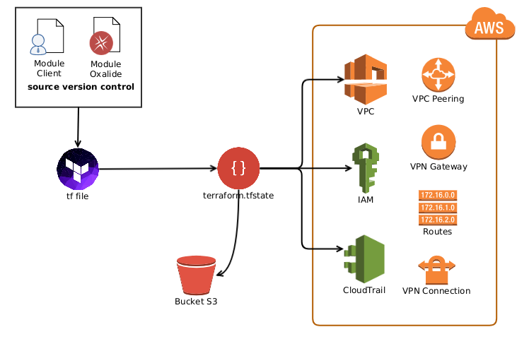

# Projet 4

La gestion de multiples environnements avec terraform est un problématique complexe.
Il existe plusieurs façons d'adresser cette contrainte.

Ce projet est aussi l'occasion d'approfondire la configuration des remotes states:

```
terraform-vault init -backend-config="bucket=remote-tf-lls-$AWS_DEFAULT_REGION-$TF_VAR_env" -backend-config="key=terraform.tfstate" -backend-config="region=$AWS_DEFAULT_REGION" -backend=true -input=true
```

-backend-config permet de surcharger les valeurs de l'objet:


```
terraform {
  backend "s3" {
    bucket = "terraform-state-prod"
    key    = "remote-tf-lls-eu-central-1-prod/terraform.tfstate"
    region = "eu-central-1"
  }
}
```

Cette datasource permet de l'utiliser:
```
data "terraform_remote_state" "lls" {
  backend = "s3"
  config {
    bucket = "terraform-state-prod"
    key    = "remote-tf-lls-eu-central-1-prod/terraform.tfstate"
    region = "eu-central-1"
  }
}
```

## [Backends](https://www.terraform.io/docs/backends/index.html)

Les backends définit la façon de stocker le state:

  Standard Backends

    artifactory
    azure
    consul
    etcd
    gcs
    http
    manta
    s3
    swift
    terraform enterprise

Pour le backend s3:


l'initialisation du backend par la commande `terraform init` doit se faire:
- Dans chaque nouvel envrionnement.
- Pour chaque changement de configuration de backend (y compris le type de backend)
- Pour supprimer un backend

```
Paramètres:

-backend=true - Initialize the backend for this environment.

-backend-config=value - Value can be a path to an HCL file or a string in the format of 'key=value'. This specifies additional configuration to merge for the backend. This can be specified multiple times. Flags specified later in the line override those specified earlier if they conflict.

-force-copy - Suppress prompts about copying state data. This is equivalent to providing a "yes" to all confirmation prompts.

-get=true - Download any modules for this configuration.

-input=true - Ask for input interactively if necessary. If this is false and input is required, init will error.

-lock=true - Lock the state file when locking is supported.

-lock-timeout=0s - Duration to retry a state lock.

-no-color - If specified, output won't contain any color.

-reconfigure - Reconfigure the backend, ignoring any saved configuration.
```

## Les modules

Nous allons comparer deux types de modules avec des approches différentes:

### 1ère approche (statique):

Dans le dossier:

    projet_4/terraform/modules/oxa-security_groups

### 2ème approche (dynamique):

Dans le dossier:
    projet_4/terraform/modules/sg_custom_monitoring

### Support or Contact

Julien BOULANGER jbo@oxalide.com
